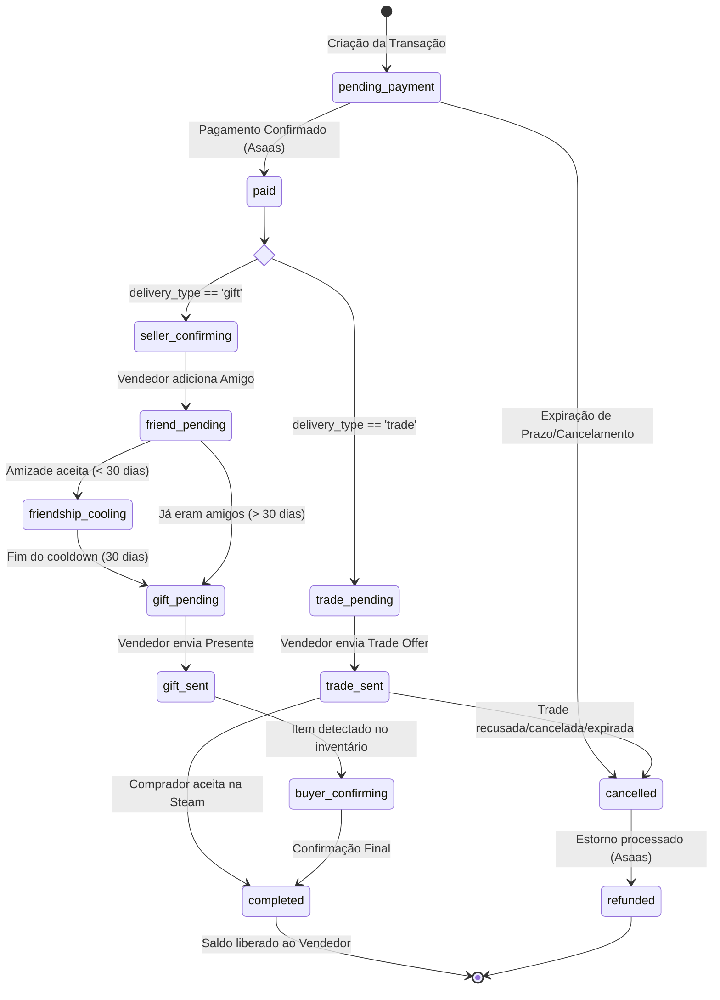

# Fluxo de Compra de Itens - Detalhamento Técnico

Este documento descreve o processo detalhado de compra de itens na plataforma, abrangendo desde a reserva inicial até a entrega final via Steam e liquidação financeira.

## 1. Visão Geral do Ciclo de Vida
A transação passa por diversos estados dependendo do tipo de entrega (**Trade** ou **Gift**).

---

## 2. Etapas Detalhadas

### Fase A: Iniciação e Pagamento
1.  **Reserva**: O comprador escolhe um item `active`. O sistema cria uma `Transaction` como `pending_payment` e muda o item para `reserved`.
2.  **Cobrança**: Se o usuário tiver CPF/Email configurado, o sistema integra com o **Asaas** para gerar um **Pix Copy & Paste** e **QR Code**.
3.  **Webhook**: Ao receber a confirmação do Asaas (`PAYMENT_RECEIVED`), o sistema move o status para `paid`.

### Fase B: Entrega via Steam
O fluxo diverge com base no `delivery_type`:

#### Tipo: Trade (Troca Direta)
*   **trade_pending**: O vendedor tem um prazo (ex: 24h) para enviar a proposta de troca na Steam.
*   **trade_sent**: O vendedor informa o ID da proposta de troca.
*   **Monitoramento**: O `steam_poller` (worker) verifica o estado da proposta na API da Steam:
    *   Se `Accepted`: Move para `completed`.
    *   Se `Declined/Expired/Cancelled`: Move para `cancelled`.

#### Tipo: Gift (Presente - Itens não trocáveis)
*   **seller_confirming**: Vendedor confirma que iniciou o processo de amizade.
*   **friendship_cooling**: Devido às restrições da Steam, é necessário aguardar **30 dias** de amizade para enviar itens de jogo (como Dota 2 Cache).
*   **gift_sent**: O vendedor envia o item como presente.
*   **Confirmação**: O worker monitora o inventário do comprador para detectar a chegada do item (`class_id` e `asset_id` correspondentes).

### Fase C: Liquidação e Payout
*   **completed**: O item é marcado como `sold`.
*   **Saldo**: O valor (menos a taxa da plataforma) é adicionado ao saldo do vendedor.
*   **Hold**: O saldo fica bloqueado para saque por um período de segurança (`seller_payout_after`), visando evitar fraudes ou chargebacks.

### Fase D: Falhas e Reembolsos
*   **cancelled**: Se o prazo de entrega expirar ou o vendedor recusar a transação.
*   **Estorno**: O worker detecta transações `cancelled` e solicita automaticamente o estorno via API do Asaas.
*   **refunded**: Status final após o dinheiro retornar ao comprador.

---

## 3. Atores e Responsabilidades

| Ator | Responsabilidade |
| :--- | :--- |
| **Backend (API)** | Validação de estoque, criação de transações e integração com Gateway de Pagamento. |
| **Worker (Poller)** | Monitoramento em tempo real da API da Steam e automação de estornos. |
| **Asaas** | Processamento de PIX e liquidação bancária. |
| **Steam API** | Verificação de inventários e status de propostas de troca. |

---

## 4. Mapeamento de Arquivos por Fase

### Fase A — Iniciação e Pagamento

| O que acontece | Arquivo |
| :--- | :--- |
| Comprador cria transação (`pending_payment`), item vira `reserved` | `app/trade/router.py` → `app/trade/service.py` |
| Geração do Pix / QR Code via Asaas | `app/payment/service.py` |
| Webhook Asaas → `paid` | `app/payment/router.py` → `app/payment/service.py` |
| Modelo de Transaction + estados | `app/trade/models.py` |

### Fase B — Entrega via Trade

| O que acontece | Arquivo |
| :--- | :--- |
| `trade_pending` → `trade_sent` (vendedor registra trade offer ID) | `app/trade/router.py` → `app/trade/service.py` |
| Poller verifica status da trade offer na Steam API | `app/worker/steam_poller.py` |
| `trade_sent` → `completed` ou `cancelled` | `app/worker/steam_poller.py` |

### Fase B — Entrega via Gift

| O que acontece | Arquivo |
| :--- | :--- |
| Transições `seller_confirming → friend_pending → gift_pending → gift_sent → buyer_confirming` | `app/trade/gift_service.py` |
| Detecção do item no inventário do comprador | `app/worker/steam_poller.py` |

### Fase C — Liquidação

| O que acontece | Arquivo |
| :--- | :--- |
| `completed` → item vira `sold`, saldo liberado ao vendedor | `app/trade/service.py` |
| Payout hold (`seller_payout_after`) | `app/trade/models.py` + `app/config.py` |

### Fase D — Falhas e Reembolsos

| O que acontece | Arquivo |
| :--- | :--- |
| Expiração do prazo de entrega → `cancelled` | `app/worker/steam_poller.py` |
| Estorno automático via Asaas | `app/worker/steam_poller.py` → `app/payment/service.py` |
| `cancelled` → `refunded` | `app/trade/service.py` |

### Cola geral

| Arquivo | Papel |
| :--- | :--- |
| `app/main.py` | Registra routers, inicia workers no `lifespan` |
| `app/trade/service.py` | `_check_transition()` — enforça transições legais |
| `app/common/dependencies.py` | `get_current_user` usado em todas as rotas protegidas |
| `app/config.py` | Variáveis de ambiente (`TRADE_DEADLINE_HOURS`, `PAYOUT_HOLD_HOURS`, etc.) |
