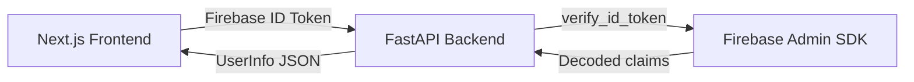

# Authentication Backend — Walkthrough

## What Was Built

A FastAPI authentication backend under `backend/` that integrates with **Firebase Authentication**. The frontend authenticates users via Firebase client SDK (Google Sign-In), then sends Firebase ID tokens to this backend for verification.

## Architecture




## API Endpoints

| Method | Path | Auth | Description |
|--------|------|------|-------------|
| `GET` | `/health` | ✗ | Health check |
| `POST` | `/api/v1/auth/login` | ✗ | Login with Firebase ID token (in body) |
| `POST` | `/api/v1/auth/verify` | ✗ | Check if token is valid |
| `GET` | `/api/v1/auth/me` | ✓ | Get current user (Bearer token) |
| `GET` | `/api/v1/users/me` | ✓ | Get current user (alias) |

## How to Run

```bash
cd backend/

# Create virtualenv + install
python3 -m venv .venv
source .venv/bin/activate
pip install -e ".[dev]"

# Copy and fill .env
cp .env.example .env
# Edit .env with your Firebase credentials

# Run tests
pytest -v

# Start server
uvicorn app.main:app --reload --port 8000

# Swagger docs → http://localhost:8000/docs
```

## Next Steps

1. **Configure Firebase** — Create a Firebase project, enable Google Sign-In, and download the service account JSON
2. **Frontend integration** — Add Firebase client SDK to the Next.js app for Google Sign-In, then send the ID token to `POST /api/v1/auth/login`
3. **Optional: Local database** — Add SQLAlchemy + SQLite/PostgreSQL if you need to store user metadata beyond what Firebase provides
